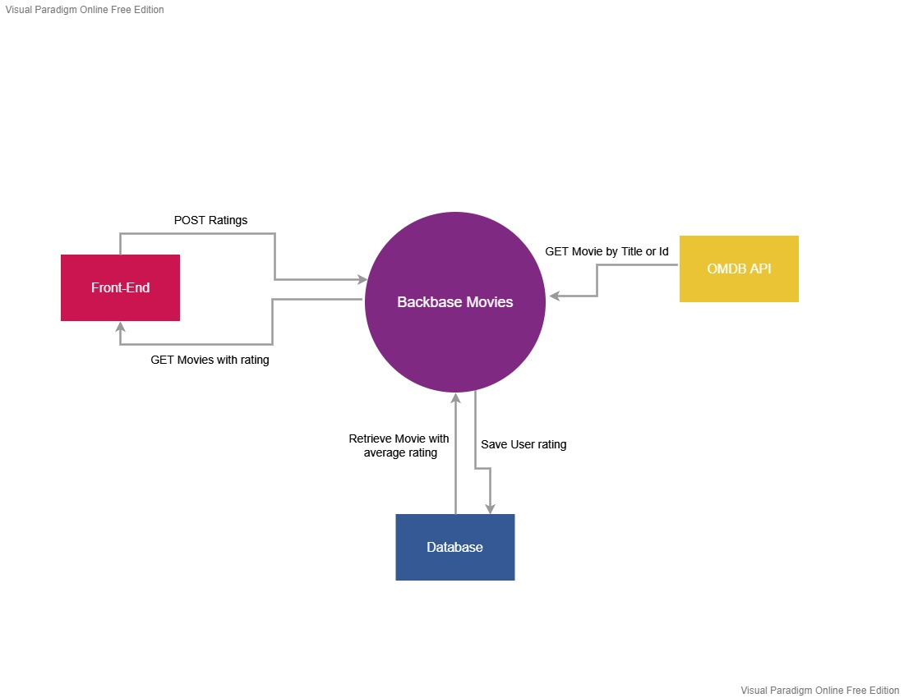

## Architectural decisions
* The API end-points are designed based on Movies & Ratings as 2 separate resources.
* Hateoas link has been added for GET/movies & GET/topMovies so that UI can use it for posting user rating.
* MovieId column in USER_RATING table has been indexed as queries to calculate are based on it especially for top-rated movies calculation.
* The security for API end-points is guarded with API-key described in property file for assignment scope.
* The API end-points have been designed to make it scalable to add all Academy awards won by the movie
* The data is persisted using relational DB(Postgres SQL).
* JPA queries are written independent of relational database and run aganist most of relational databases.
* The rest resources are defined according to Open-API specifications.
* The solution is designed and developed to be also a cloud deployable component(Azure App-services) with minimal changes.
* The performance of the application is also considered by guaranteeing response time at O(n) - response time in milliseconds.

## System-context diagram
